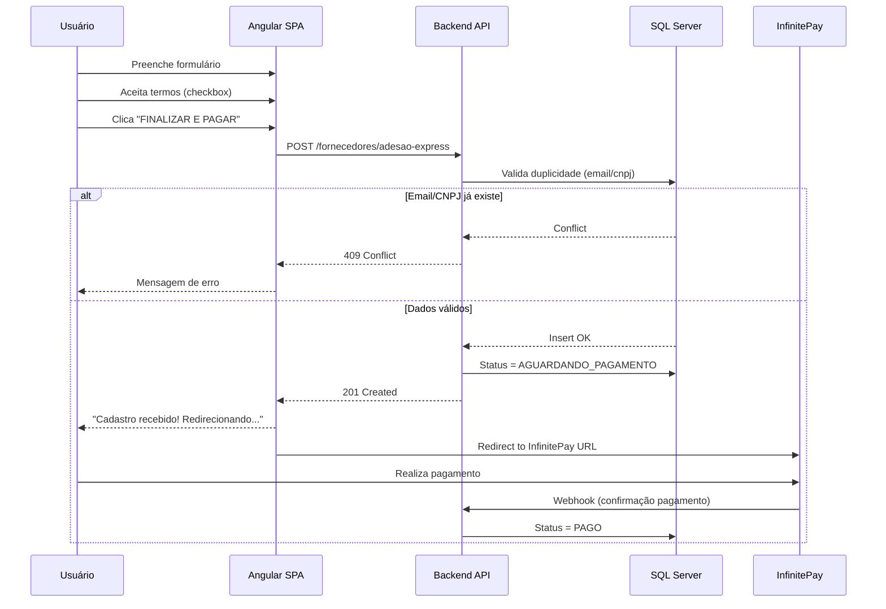

# API - Requisito: Endpoint de Adesão Express

## 📌 Contexto

Página de conversão **`/:cidade/indicado`** (Adesão Express) captura dados do fornecedor indicado, obtém aceite jurídico (clickwrap) e redireciona para pagamento InfinitePay sem intervenção humana.

---

## 🎯 Objetivo

Criar endpoint para **salvar cadastro preliminar** de fornecedor indicado antes do pagamento, garantindo que os dados não sejam perdidos e permitindo posterior ativação após confirmação de pagamento.

---

## 📡 Especificação do Endpoint

### **POST** `/api/v1/fornecedores/adesao-express`

#### **Headers**
```http
Content-Type: application/json
Accept: application/json
```

#### **Request Body** (JSON)
```json
{
  "nomeFantasia": "Decorações Florais Piracicaba",
  "instagramOficial": "@decoracoesflorais",
  "cnpjCpf": "12345678000190",
  "nomeResponsavel": "Maria Silva",
  "whatsapp": "19999999999",
  "email": "maria@decoracoesflorais.com.br",
  "autorizaFotos": true,
  "aceitaTermos": true,
  "dataAceite": "2026-01-15T14:30:00.000Z"
}
```

#### **Request Body - Descrição dos Campos**

| Campo | Tipo | Obrigatório | Validação | Descrição |
|-------|------|-------------|-----------|-----------|
| `nomeFantasia` | `string` | Sim | Min 3 caracteres | Nome fantasia da empresa/fornecedor |
| `instagramOficial` | `string` | Sim | Formato `@username` | Instagram oficial (usado para concierge de fotos) |
| `cnpjCpf` | `string` | Sim | 11 ou 14 dígitos numéricos | CPF (11) ou CNPJ (14) sem formatação |
| `nomeResponsavel` | `string` | Sim | Min 3 caracteres | Nome completo do responsável legal |
| `whatsapp` | `string` | Sim | 10 ou 11 dígitos numéricos (DDD + número) | WhatsApp sem formatação |
| `email` | `string` | Sim | Formato válido de e-mail | E-mail (será login de acesso futuro) |
| `autorizaFotos` | `boolean` | Sim | `true` or `false` | Autorização para uso de fotos do Instagram |
| `aceitaTermos` | `boolean` | Sim | **DEVE SER `true`** | Aceite dos Termos de Uso (clickwrap legal) |
| `dataAceite` | `string` | Sim | ISO 8601 datetime | Data/hora do aceite dos termos (UTC) |

---

## ✅ Response - Sucesso (201 Created)

```json
{
  "success": true,
  "message": "Cadastro preliminar recebido com sucesso",
  "data": {
    "fornecedorId": "uuid-v4-gerado",
    "email": "maria@decoracoesflorais.com.br",
    "status": "AGUARDANDO_PAGAMENTO",
    "dataAceite": "2026-01-15T14:30:00.000Z"
  }
}
```

---

## ❌ Response - Erros

### **400 Bad Request** - Validação de campos
```json
{
  "success": false,
  "message": "Erro de validação",
  "errors": [
    {
      "campo": "email",
      "mensagem": "E-mail inválido"
    },
    {
      "campo": "cnpjCpf",
      "mensagem": "CPF/CNPJ inválido"
    }
  ]
}
```

### **409 Conflict** - E-mail já cadastrado
```json
{
  "success": false,
  "message": "E-mail já cadastrado no sistema",
  "error": "DUPLICATE_EMAIL"
}
```

### **500 Internal Server Error** - Erro no servidor
```json
{
  "success": false,
  "message": "Erro interno ao processar cadastro. Tente novamente."
}
```

---

## 🗄️ Modelo de Dados Sugerido

### Tabela: `FornecedoresAdesaoExpress`

| Coluna | Tipo | Nullable | Descrição |
|--------|------|----------|-----------|
| `Id` | `Guid` (PK) | Não | Chave primária UUID |
| `NomeFantasia` | `nvarchar(200)` | Não | Nome fantasia |
| `InstagramOficial` | `nvarchar(100)` | Não | Instagram (@username) |
| `CnpjCpf` | `nvarchar(14)` | Não | CPF/CNPJ sem formatação (índice único) |
| `NomeResponsavel` | `nvarchar(200)` | Não | Nome do responsável |
| `Whatsapp` | `nvarchar(11)` | Não | WhatsApp sem formatação |
| `Email` | `nvarchar(255)` | Não | E-mail (índice único) |
| `AutorizaFotos` | `bit` | Não | Flag de autorização Instagram |
| `AceitaTermos` | `bit` | Não | Flag de aceite legal |
| `DataAceite` | `datetime2` | Não | Data/hora do aceite (UTC) |
| `Status` | `nvarchar(50)` | Não | Status: `AGUARDANDO_PAGAMENTO`, `PAGO`, `ATIVO`, `CANCELADO` |
| `DataCriacao` | `datetime2` | Não | Data/hora da criação (UTC) |
| `DataAtualizacao` | `datetime2` | Sim | Data/hora da última atualização |
| `IpOrigem` | `nvarchar(50)` | Sim | IP do cliente (opcional, para auditoria) |
| `UserAgent` | `nvarchar(500)` | Sim | User-Agent (opcional, para auditoria) |

### Índices recomendados:
- `UNIQUE INDEX` em `Email`
- `UNIQUE INDEX` em `CnpjCpf`
- `INDEX` em `Status`
- `INDEX` em `DataCriacao`

---

## 🔒 Regras de Negócio

1. **Validação de duplicidade:**
   - Verificar se `email` já existe na base (retornar `409 Conflict`)
   - Verificar se `cnpjCpf` já existe na base (retornar `409 Conflict`)

2. **Status inicial:**
   - Todo novo cadastro deve ter `Status = "AGUARDANDO_PAGAMENTO"`
   - Após confirmação de pagamento (webhook InfinitePay ou manual), atualizar para `PAGO`

3. **Aceite obrigatório:**
   - Campo `aceitaTermos` **DEVE ser `true`** (validação backend)
   - Se `false`, retornar `400 Bad Request` com mensagem: "Aceite dos termos é obrigatório"

4. **Auditoria:**
   - Armazenar `dataAceite` fornecida pelo frontend (timestamp do aceite legal)
   - Registrar `dataCriacao` automaticamente no servidor

5. **LGPD:**
   - Dados são tratados apenas para finalidade de cadastro e onboarding
   - Usuário poderá solicitar exclusão antes de efetuar pagamento

---

## 🔄 Fluxo Completo



---

## 🧪 Testes Sugeridos

### Unit Tests
- Validação de CPF (11 dígitos)
- Validação de CNPJ (14 dígitos)
- Validação de e-mail (formato)
- Validação de Instagram (começa com @)
- Rejeição de `aceitaTermos = false`

### Integration Tests
- POST com dados válidos → `201 Created`
- POST com e-mail duplicado → `409 Conflict`
- POST com CNPJ duplicado → `409 Conflict`
- POST com `aceitaTermos = false` → `400 Bad Request`
- POST com CPF inválido → `400 Bad Request`
- POST com campos faltando → `400 Bad Request`

---

## 📋 Checklist de Implementação

- [ ] Criar migration/script SQL para tabela `FornecedoresAdesaoExpress`
- [ ] Implementar validações de CPF/CNPJ no backend
- [ ] Implementar verificação de duplicidade (email, cnpjCpf)
- [ ] Implementar endpoint `POST /api/v1/fornecedores/adesao-express`
- [ ] Retornar response 201 Created com `fornecedorId`
- [ ] Adicionar logging/auditoria (IP, User-Agent, dataAceite)
- [ ] Implementar testes unitários
- [ ] Implementar testes de integração
- [ ] Documentar endpoint no Swagger/OpenAPI
- [ ] Testar integração com frontend Angular

---

## 📝 Observações Técnicas

### CORS
Garantir que o endpoint aceite requisições do domínio:
- `https://dev.guianoivas.com`
- `https://guianoivas.com`

### Rate Limiting
Considerar rate limit para evitar spam (ex: 5 requisições por IP a cada 10 minutos).

### Webhook InfinitePay (próxima fase)
Endpoint futuro para receber confirmação de pagamento e atualizar status:
- `POST /api/v1/webhooks/infinitepay/pagamento`

---

## 🔗 Links de Referência

- **InfinitePay Link:** `https://link.infinitepay.io/guianoivaspiracicaba/Ri1D-72iRl1Vgzd-397,00`
- **Página Frontend:** `/:cidade/indicado` (ex: `/piracicaba/indicado`)
- **Termos de Uso completos:** Incluídos no campo scrollável da página

---

**Data:** 15/01/2026  
**Versão:** 1.0  
**Autor:** Equipe Frontend - Guia Noivas
